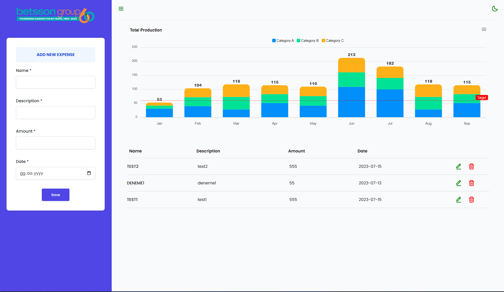
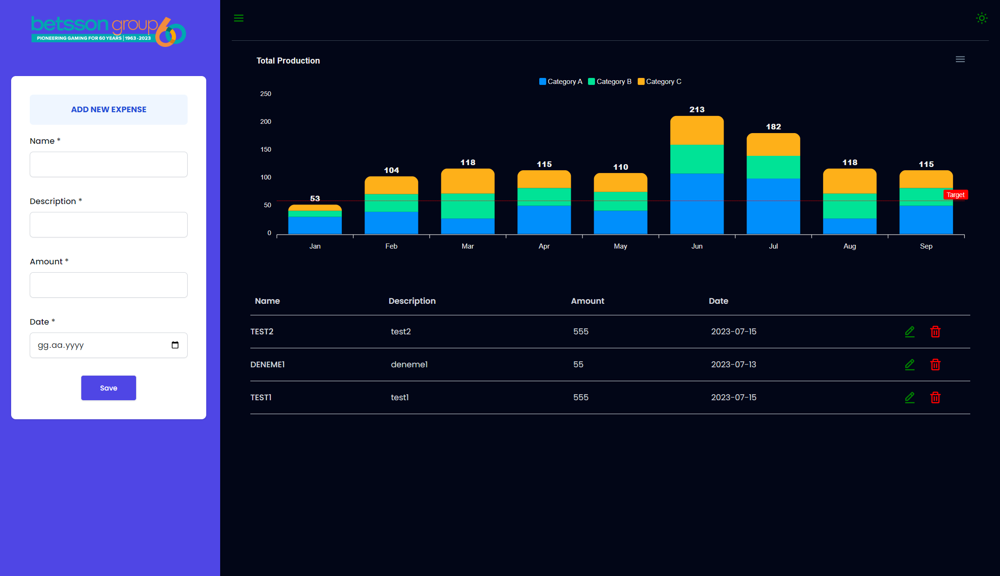

# Betssons-Web3 Frontend Interview


## Project setup for development - backend with express JS

```
cd backend
npm install
npm run start
```
- Using 5000 port 

## Project setup for development - frontend with stencil JS

```
cd frontend
npm install
npm run start
```
 

### UX Improvements

- A better UI/UX design can be made by improving the design.(Especially mobile design.) I'm leaving it at this stage because of my busy.

 Not: Since there is no field for chart, a static definition was made for the "tooltip" example.


#### Screenshots  


 

#### Contact details.

> [LinkedIn](https://www.linkedin.com/in/cihankoc/)